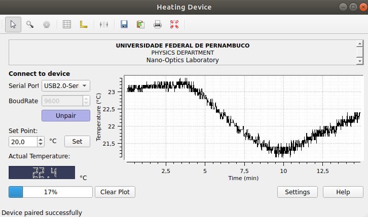

# heating-device

This is an user-interface software for a heating device that acts to hold at a constant setpoint (PID controller) the temperature in a thermal blanket. The communication PC-Heater is done by an Arduino, and more info about the hardware and technical specifications can be found in the microcontroller source file.

By clicking on 'Pair' push-button, you start the communication and allow the software receiving the temperature data. It will be shown in the plot. The setpoint is automatically set to 20°C. Increase it to turn on the heating.

By clicking on 'Settings' push-button, you can adjust the PID parameters and the max/min temperature. These specifications will be saved and automatically loaded when the software opens again.

-------------------------------------------------------------------------------------------
Created by Allison Pessoa (allisonpessoa@hotmail.com) for academic purposes.

Please contact me to report misfunctions.
